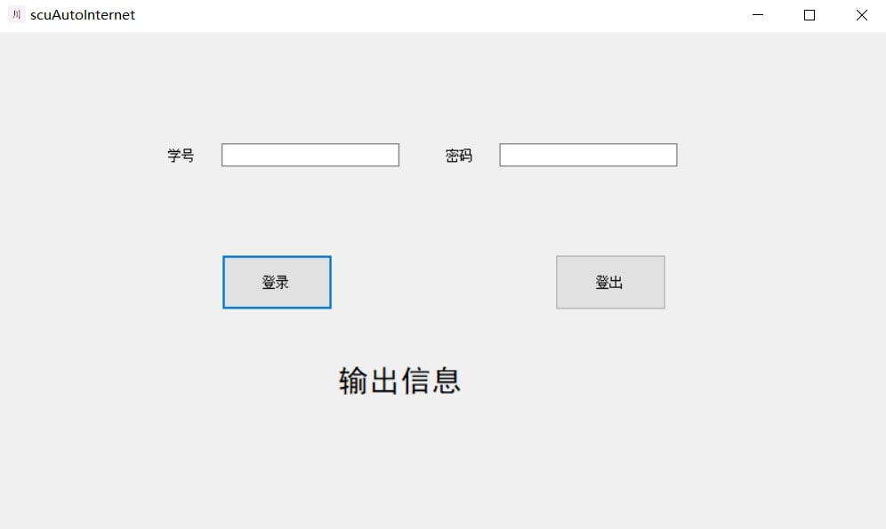
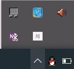
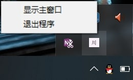

# scuAutoInternet-win64
[](https://github.com/2239559319/scuAutoInternet-win64/blob/master/LICENSE)


### 四川大学校园网自助管理系统

-----------
### 运行环境 windows10 64位

### 功能
1. 点击登录按钮登录校园网
2. 点击登出按钮自动登出校园网
3. 在关机时自动登出校园网(程序需在后台运行不退出)

### 用法
1. 下载，点击右边的链接下载可执行文件[下载链接][1]scuAutoInternet.exe文件(注意不要把文件放到c盘权限高的文件夹下)

2. 运行exe文件进入主界面


    !注意关闭窗口会将程序最小化到托盘

    右下角会出现程序的托盘



3. 双击托盘会显示窗口,右键托盘出现选项:显示窗口或者退出程序(这才是退出程序的正确方式)


4. 在程序运行时(不点托盘右键退出)关机或者重启程序会自动退出校园网账号

### 构建
- .net framework4.7.2 vs2019 windows10 x64

### 添加到开机自启动
- 右键pro.exe创建快捷方式,将此快捷方式复制到以下文件夹
```text
C:\Users\yourname\AppData\Roaming\Microsoft\Windows\Start Menu\Programs\Startup
其中yourname是你自己的主文件夹
```

### 程序交流,bug发送邮件到w2239559319@outlook.com
[1]:https://github.com/2239559319/scuAutoInternet-win64/releases/download/0.0.3/autoInternet.exe